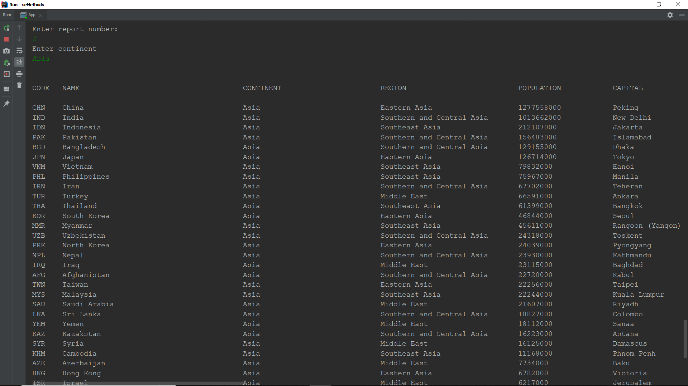

# DevOps Group-7

| Scrum Role  | Member Name |
| ------------- | ------------- |
| Scrum Master | Tin Aung Yin |
| Development Leader | Myat Thu Ta |
| Product Owner  | Min Hein Htet |

| ID | Name | Met | Screenshot |
| --- | --- | --- | --- |
| 1 | All the countries in the world organised by largest population to smallest. | Yes |  |
| 2 | All the countries in a continent organised by largest population to smallest. | Yes |  |
| 3 | All the countries in a region organised by largest population to smallest. | Yes |  |

- Add Build Badge 
- Add License Badge 
- Develop Build Status 
- Add Release Badge 
